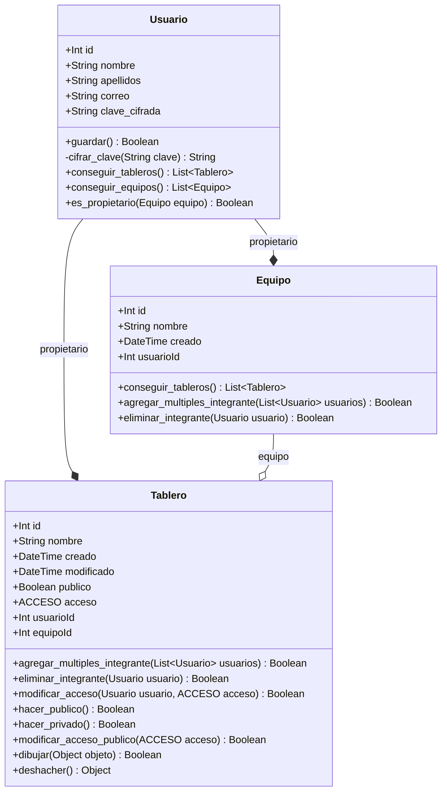

## Lista de clases
* Usuario
* Tablero
* Equipo
* Permiso

```mermaid
classDiagram
class Usuario{
    +Int id
    +String nombre
    +String apellidos
    +String correo
    +String clave_cifrada

    +guardar() Boolean
    -cifrar_clave(String clave) String
    +conseguir_tableros() List~Tablero~
    +conseguir_equipos() List~Equipo~
    +es_propietario(Equipo equipo) Boolean
}

class Equipo{
    +Int id
    +String nombre
    +DateTime creado
    +Int usuarioId

    +conseguir_tableros() List~Tablero~
    +agregar_multiples_integrante(List~Usuario~ usuarios) Boolean
    +eliminar_integrante(Usuario usuario) Boolean
}

class Tablero{
    +Int id
    +String nombre
    +DateTime creado
    +DateTime modificado
    +Boolean publico
    +ACCESO acceso
    +Int usuarioId
    +Int equipoId

    +agregar_multiples_integrante(List~Usuario~ usuarios) Boolean
    +eliminar_integrante(Usuario usuario) Boolean
    +modificar_acceso(Usuario usuario, ACCESO acceso) Boolean
    +hacer_publico() Boolean
    +hacer_privado() Boolean
    +modificar_acceso_publico(ACCESO acceso) Boolean
    +dibujar(Object objeto) Boolean
    +deshacher() Object
}
Usuario --* Equipo : propietario
Usuario --* Tablero : propietario
Equipo --o Tablero : equipo


```