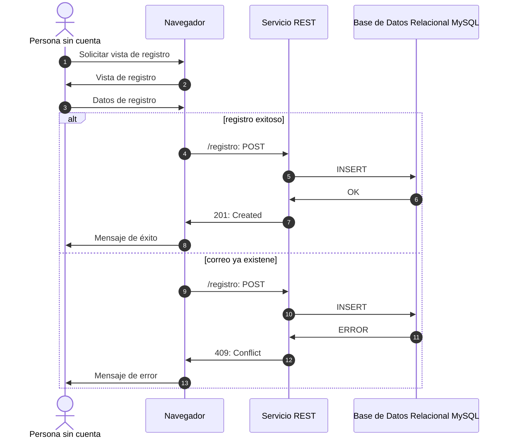

## Registro

```mermaid
sequenceDiagram
    autonumber
    actor P as Persona sin cuenta
    participant N as Navegador
    participant R as Servicio REST
    participant BD as Base de Datos Relacional MySQL
    
    P->>N: Solicitar vista de registro
    N->>P: Vista de registro
    P->>N: Datos de registro
    alt registro exitoso
        N->>R: /registro: POST
        R->>BD: INSERT
        BD->>R: OK
        R->>N: 201: Created
        N->>P: Mensaje de éxito
    else correo ya existene
        N->>R: /registro: POST
        R->>BD: INSERT
        BD->>R: ERROR
        R->>N: 409: Conflict
        N->>P: Mensaje de error
    end
```